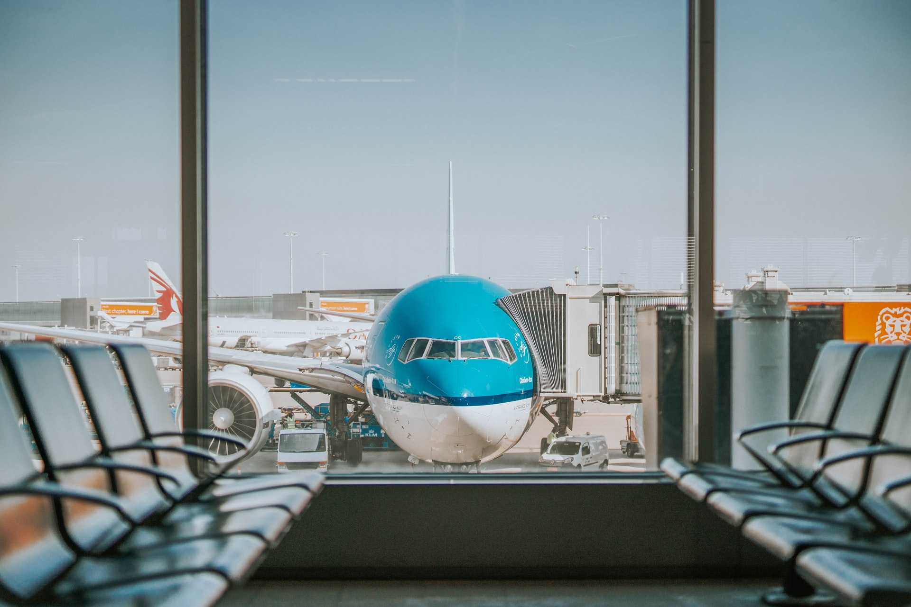
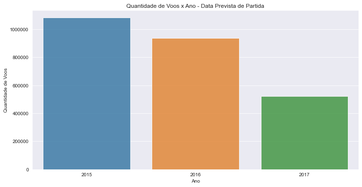
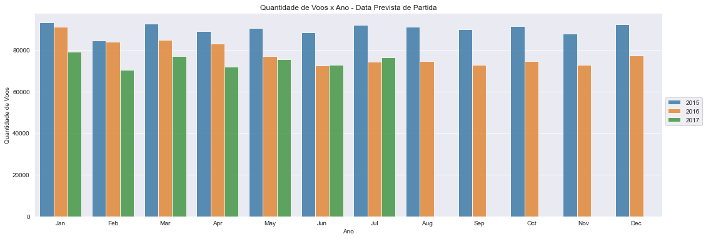
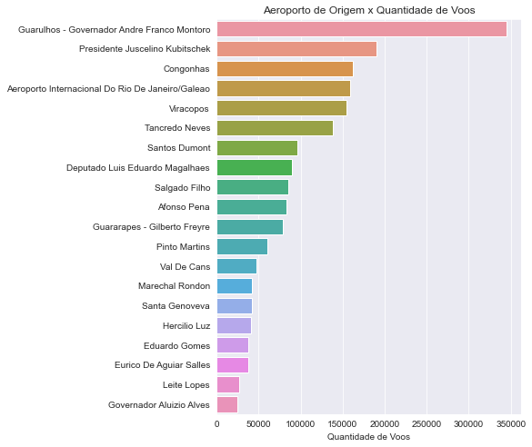

# Análise Exploratória dos Voos do Brasil


[Fonte](https://unsplash.com/photos/DDBDkz0p918)

Essa análise tem como objetivo o ganho de experiência na exploração de dados. Como forma de aprendizado foi utilizado um dataset do Kaggle para exploração.

## Fonte de Dados

Foi utilizado o dataset [Flights in Brazil](https://www.kaggle.com/ramirobentes/flights-in-brazil) hospedado no kaggle. A base de dados contém voos do Brasil entre os anos de 2015 à 2017.

Para leitura desses dados você precisará definir o encoding do DataFrame no formato abaixo: 

```
df = pd.read_csv('BrFlights2.csv', encoding = 'latin1')
```

## Bibliotecas Utilizadas

```
pandas
numpy
seaborn
matplotlib.pyplot
pandas_profiling
```

## PROCESSO DE EXPLORAÇÃO DE DADOS

### Pandas Profiling
Inicialmente foi utilizado a biblioteca pandas profiling para conhecimento do dataset e como estava a disposição dos seus dados. Devido ao grande volume de dados, foram analisado 100000 linhas aleatórias no pandas profiling.

[Você pode encontrar mais detalhes no arquivo html do profiling.](https://github.com/lucasmbribeiro/exemplo_repositorio/blob/main/df_voos_profile_dark_mode.html) 

### Tratamento dos Dados

Na fase de tratamento dos dados foram explorados alguns pilares:

* Nomenclatura das colunas: O nome das colunas foram ajustadas para o padrão snake_case.
* Tipo de Dados: Para as colunas necessárias o data type foi alterado para o que mais se adaptava a informação.
* Informações nulas: Algumas colunas continham valores nulos e para isso fomos entender o que ocorreu com esses dados.

### Conhecendo os Dados

__Quantidade de Voos x Data de Previsão de Partida__



<br> __Quantidade de Voos x Data de Previsão de Partida (MÊS)__


__

<br> __Quebra por Ano/mês - Evolução__


<br> __Quais são os aeroportos de origem que tem mais voos?__

Tabela do TOP 20 aeroportos de origem.

| Aeroporto de Origem                              | Quantidade de Voos | % Do Total | % Acumulado |
|--------------------------------------------------|--------------------|------------|-------------|
| Guarulhos - Governador Andre Franco Montoro      | 344835             | 13.563     | 13.563      |
| Presidente Juscelino Kubitschek                  | 190010             | 7.473      | 21.036      |
| Congonhas                                        | 162301             | 6.383      | 27.419      |
| Aeroporto Internacional Do Rio De Janeiro/Galeao | 158571             | 6.237      | 33.656      |
| Viracopos                                        | 154737             | 6.086      | 39.742      |
| Tancredo Neves                                   | 138723             | 5.456      | 45.198      |
| Santos Dumont                                    | 95947              | 3.774      | 48.972      |
| Deputado Luis Eduardo Magalhaes                  | 89312              | 3.513      | 52.485      |
| Salgado Filho                                    | 85470              | 3.362      | 55.847      |
| Afonso Pena                                      | 83567              | 3.287      | 59.134      |
| Guararapes - Gilberto Freyre                     | 78421              | 3.084      | 62.218      |
| Pinto Martins                                    | 60151              | 2.366      | 64.584      |
| Val De Cans                                      | 47195              | 1.856      | 66.440      |
| Marechal Rondon                                  | 42058              | 1.654      | 68.094      |
| Santa Genoveva                                   | 41921              | 1.649      | 69.743      |
| Hercilio Luz                                     | 41096              | 1.616      | 71.359      |
| Eduardo Gomes                                    | 37847              | 1.489      | 72.848      |
| Eurico De Aguiar Salles                          | 37756              | 1.485      | 74.333      |
| Leite Lopes                                      | 26515              | 1.043      | 75.376      |
| Governador Aluizio Alves                         | 25265              | 994        | 76.370      |


<br> 

